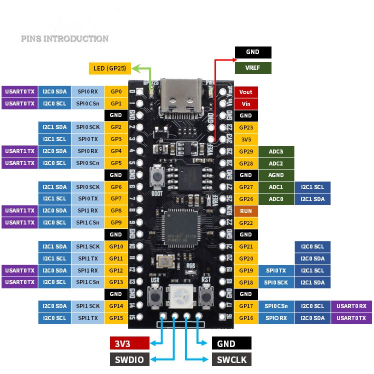
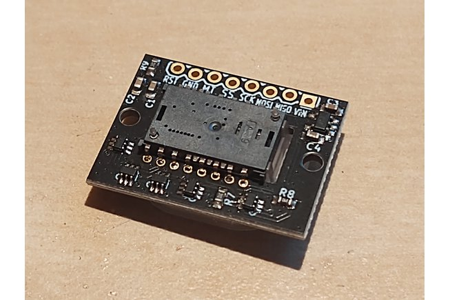

## RP2040 Schematic

[link](https://www.aliexpress.us/item/3256804258715020.html?spm=a2g0o.order_list.order_list_main.21.11781802YYJvoL&gatewayAdapt=glo2usa)

## PMW3389 Schematic

[link](https://www.tindie.com/products/citizenjoe/pmw3389-motion-sensor/)

Pinout:
```
RST = Reset
GND = Ground
MT = Motion (active low interrupt line)
SS = Slave Select / Chip Select
SCK = SPI Clock
MOSI = MOSI
MISO = MISO
VIN = Voltage in up to +5.5V
```

## Connections
PMW3389 to RP2040
```
GND <=> GND
MT <=> GP6
SS <=> GP5 (SPI0 CSn)
SCK <=> GP2 (SPI0 SCK)
MOSI <=> GP3 (SPI0 TX)
MISO <=> GP4 (SPI0 RX)
VIN <=> 3v3
```

Matrix to RP2040
```
ROW1 <=> GP12
ROW2 <=> GP13
ROW3 <=> GP14
ROW4 <=> GP15

COL1 <=> GP21
COL2 <=> GP20
COL3 <=> GP19
COL4 <=> GP18
COL5 <=> GP17
COL6 <=> GP16
```

TRRS to RP2040
```
GP0
GP1
VOUT (5V)
GND
```

## Notes to Self
Install QMK (on arch):

    sudo pacman -S qmk
    make git-submodule

One time flashes to set the half in the eeprom (should not have to be done again):

    qmk flash -kb handwired/dactyl_manuform/psxpaul_4x6_tb -km default -bl uf2-split-left
    qmk flash -kb handwired/dactyl_manuform/psxpaul_4x6_tb -km default -bl uf2-split-right

If you get "Chip already blank, to force erase use --force." error:

    dfu-programmer atmega32u4 erase --force
    (see https://github.com/qmk/qmk_firmware/issues/22472 or https://github.com/qmk/qmk_firmware/issues/22050#issuecomment-1722308968)

To compile:

    qmk compile -kb handwired/dactyl_manuform/psxpaul_4x6_tb -km default

To flash:

    qmk flash -kb handwired/dactyl_manuform/psxpaul_4x6_tb -km default

   *important: do not use a hub/dock while flashing!*


## Bootloader

Enter the bootloader in 3 ways:

* **Bootmagic reset**: Hold down the key at (0,0) in the matrix (usually the top left key or Escape) and plug in the keyboard
* **Physical reset button**: Hold the boot button when plugging in the device
* **Keycode in layout**: Press the key mapped to `QK_BOOT` if it is available